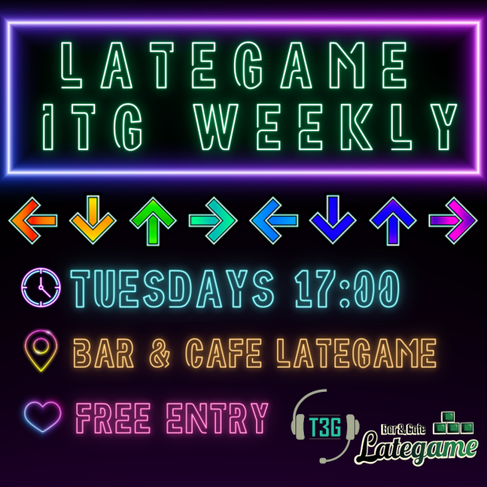

# Tampereen rytmipelaajat ry

Tr3 Gamers is a gaming club for the students of Tampere University and Tampere
University of Applied Sciences! We organize events and gaming sessions for
a variety of games and help stream other clubs' events to the masses.

[**Join us now!**](https://holvi.com/shop/tr3gamers/product/c23bc0b7da96a52f7adcfc408b88798c/) Our membership fee is 5€ per year.

## Smash Bros

T3G has a long history in Smash! We have been organizing large scale tournaments like
Bob-Omb Battlefield and [Smash Sauna](https://twitter.com/SmashSauna). We also
have monthlies at our clubroom!

The **monthlies are typically held on the first Tuesday of the month 17.00-22.00**, see #tampere
in [Smash Finland's Discord](https://smashfinland.fi/) for registration each month. Currently,
they are on hiatus due to a *situation* at our clubroom.

## Dancing games

Ever seen those videos of people dancing on a pad and hitting sliding arrows?
We do that here! We primarily play with ITGMania. The clubroom has two modded
pads, a big 120 fps screen, and a massive fan for cooling. Bring your water
bottle and sweatpants, this e-sport is very physical!

Due to the *situation* at our clubroom, the weeklies have been moved to Bar & Cafe Lategame.
We have **weeklies every Tuesday 18.00-22.00** (the image below is a bit outdated, we start
at **18**, not **17**). You can ask more info on the #tanssipelit channel on our Discord!

Beginners welcome! Our friendly community regularly helps new players get
started. It's completely free even if you aren't a member, so you can just try
it out once or twice to see if dance games are for you!

## Events

We organize various gaming-related events, like RWPT (Random WideoPeliTurnaus)
during Wappu, LAN events and tournaments.

## Streaming

We have a large amount of streaming gear at our clubroom, as well as the
know-how for organizing livestreams for students events! Contact us at
tr3gamersry (at) gmail.com if you're interested in this kind of services.

# Find us on campus

Our clubroom is currently moving to a temporary space. The old clubroom
in Bommari has mold damage. The new temporary space is FB322, Festia,
Hervanta.

We'll likely be getting a more permanent clubroom again sometime next year.

# Clubroom calendar

Here you can find our clubroom's reservation status. Reservation type is marked with an emoji:

🟢 = Open doors, welcome!

🟡 = Only come if you have a key.

🔴 = Closed door reservation, visit only briefly if absolutely necessary.
